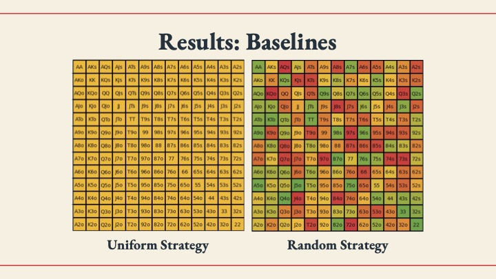
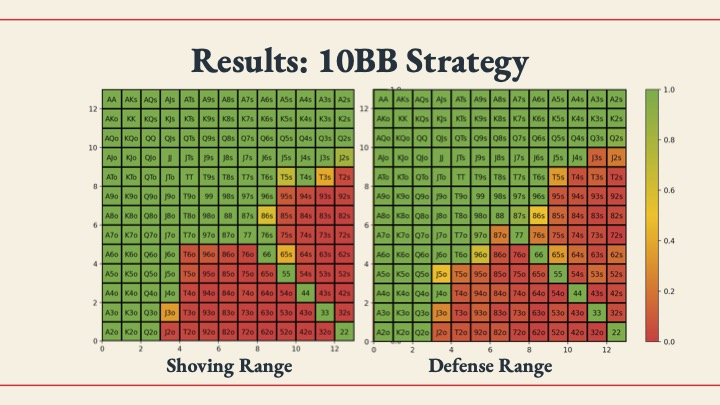
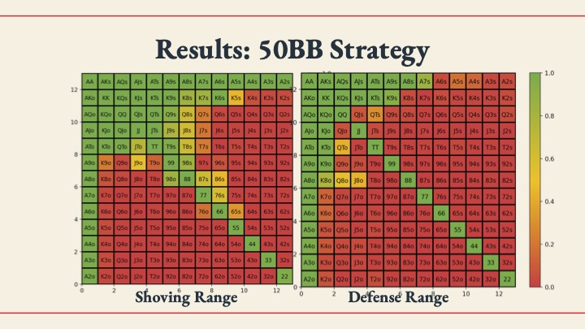
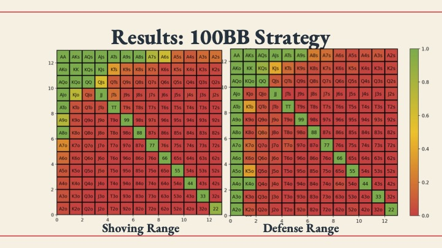
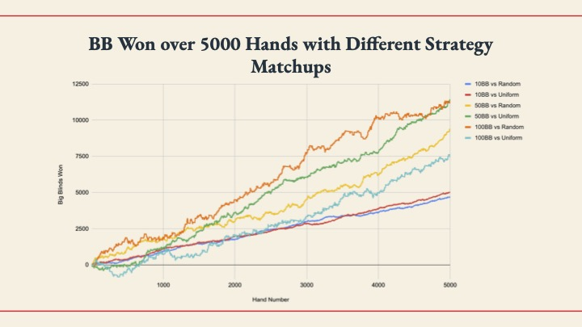

# Understanding Push-Fold Pre-Flop Strategy for Heads Up NLH Poker
## A Simplified Solver for HUNL Poker

### Background: 

- Poker is a card game where players are dealt cards, and bet across multiple rounds based on the strength of their hand with the goal to win the most amount of money.
- Poker has many variants, including No Limit Texas Hold’ Em (one of the most popular), Pot Limit Omaha (PLO), Limit Texas Hold’ Em, as well as many others.
- There have been many attempts to solve poker. In 2007, the Counterfactual Regret Minimization (CFR) algorithm was published [1], which has proven to be the standard algorithm for solving games like Poker. More recently, researchers at CMU built Libratus [2], which applied the CFR algorithm (along with other AI techniques) to try to build the best heads-up poker bot in existence.

### Basic Strategy 

- Bet to get worse hands to call (A Value Bet)
- Bet to get better hands to fold (A Bluff)

### A Simplified Strategy

- Before the flop, we are either going to fold, or go all in with 10BB against our opponent’s 2BB open.
- The other player can either call this all in, or fold.
- No post flop play. This massively simplifies the game, and the number of decisions we
have to make.

### Results:

